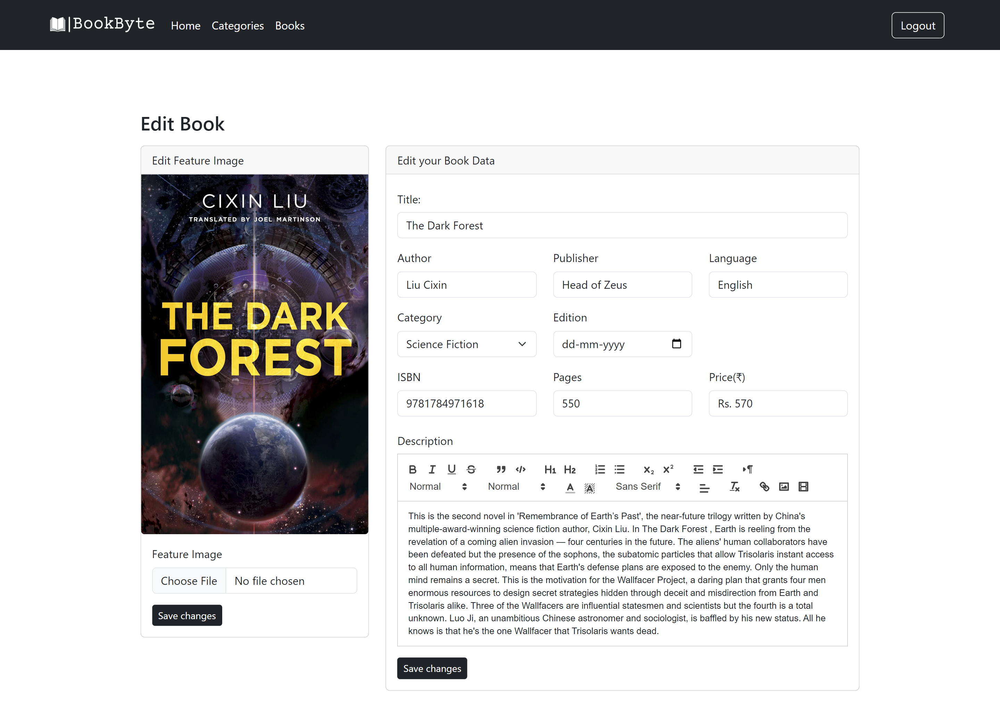

# Admin Panel for Book Management

This project is an admin panel developed using AngularJS. It facilitates various book management tasks such as adding, editing, and deleting books, as well as viewing detailed information about each book. Additionally, it includes category management functionality, allowing the addition, editing, and deletion of categories.

## Screenshot

Login - 

Home - 

Category Listing - 

Book Listing - 

Book Details - 

## Technologies Used

- **AngularJS**
- **JavaScript**
- **CSS**
- **HTML**

## Features

- **Dynamic Book Listing Page**: View a list of books with options to add, edit, and delete entries.
- **Detailed Book View**: View detailed information about each book.
- **Category Management**: Add, edit, and delete book categories.

